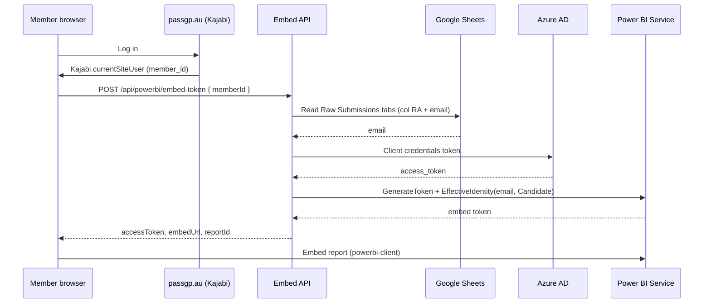

# PassGP Power BI Embed API

Backend service that embeds Power BI analytics for PassGP members on [passgp.au](https://www.passgp.au). Members authenticate through Kajabi only; the API mints short-lived Power BI embed tokens with row-level security (RLS) so each student sees only their own data—no separate Microsoft sign-in.

---

## Overview

| Layer | Responsibility |
|-------|----------------|
| **Kajabi** | Member session; exposes `member_id` in the browser |
| **This API** | Resolves `member_id` → email, calls Azure AD + Power BI `GenerateToken` |
| **Power BI** | Shared report; RLS role `Candidate` filters by `USERPRINCIPALNAME()` |
| **Google Sheets** | Source of truth for `member_id` → email mapping on form submissions |

**Authentication model:** App Owns Data (service principal). The Azure app owns access to the workspace; per-member identity is passed via `EffectiveIdentity` at token generation time.

---

## Architecture



---

## Tech stack

- **Runtime:** Node.js 18+, TypeScript (ESM)
- **HTTP:** Express 4
- **Identity:** Azure AD OAuth2 client credentials
- **Analytics:** Power BI REST API (`GenerateToken`)
- **Lookup:** Google Sheets API (service account)
- **Frontend embed:** `powerbi-client` (loaded from CDN in `kajabi-embed.js`)

---

## Project structure

```
passgp-powerbi-embed/
├── src/
│   ├── server.ts              # HTTP server entrypoint
│   ├── app.ts                 # Express app wiring
│   ├── config/env.ts          # Environment configuration
│   ├── controllers/           # Request handlers
│   ├── middleware/            # CORS, API key, errors
│   ├── routes/                # API routes
│   ├── services/
│   │   ├── azure-auth.service.ts
│   │   ├── powerbi.service.ts
│   │   ├── member-lookup.service.ts
│   │   └── embed.service.ts
│   └── domain/                # Types and errors
├── public/
│   ├── kajabi-embed.js        # Kajabi page embed script
│   └── embed-test.html        # Local manual test page
├── .env.example
└── package.json
```

---

## How it works

### 1. Member identity (Kajabi)

The browser reads `member_id` from `Kajabi.currentSiteUser` (`contactId` or `id`). This is sent to the API on every embed request. Kajabi is the sole identity source for Phase 2.

### 2. Email lookup (Google Sheets)

The API maps `member_id` to the member's email for Power BI RLS:

- **Spreadsheet:** Live PassGP mock exam data (see `GOOGLE_SHEETS_ID`)
- **Tabs scanned:** All sheets whose name starts with `Raw Submissions` (e.g. AKT Half Mock Exam A, KFP Full Mock Exam B, …)
- **`member_id` column:** Fixed column **RA** on every submission tab (agreed with client—do not move per form length)
- **Email column:** Header `Enter your email address:`

If Google Sheets is unavailable, `MEMBERS_MAP_JSON` can be used as a **local dev fallback** only.

### 3. Embed token (Power BI)

1. Authenticate with Azure using `AZURE_CLIENT_ID` / `AZURE_CLIENT_SECRET`
2. Load report metadata from the configured workspace
3. Call `POST .../reports/{reportId}/GenerateToken` with:
   - `accessLevel`: `View`
   - `identities`: `[{ username: email, roles: [Candidate], datasets: [datasetId] }]`

### 4. RLS (semantic model)

The Power BI semantic model must define role **`Candidate`** with a DAX filter such as:

```dax
[Student_Email] = USERPRINCIPALNAME()
```

Without RLS on the dataset, Power BI returns: *"dataset shouldn't have effective identity"*.

---

## API reference

Base path: `/api`

### `GET /api/health`

Liveness and dependency checks.

**Response `200` (healthy)** or **`503` (degraded):**

```json
{
  "status": "ok",
  "service": "passgp-powerbi-embed",
  "checks": {
    "azure": true,
    "powerBi": true,
    "memberLookup": true
  }
}
```

### `GET /api/config`

Non-secret configuration summary (RLS role, CORS origins, whether embed env is complete).

### `GET /api/powerbi/embed-token`

Mint an embed token (convenience for browser/curl testing).

| Query | Required | Description |
|-------|----------|-------------|
| `memberId` | Yes | Kajabi member ID |

**Example:**

```http
GET /api/powerbi/embed-token?memberId=2453739162
```

### `POST /api/powerbi/embed-token`

Primary endpoint used by `kajabi-embed.js`.

| Body field | Required | Description |
|------------|----------|-------------|
| `memberId` | Yes | Kajabi member ID |

**Example:**

```http
POST /api/powerbi/embed-token
Content-Type: application/json

{ "memberId": "2453739162" }
```

**Success `200`:**

```json
{
  "accessToken": "<embed-token>",
  "embedUrl": "https://app.powerbi.com/reportEmbed?reportId=...",
  "reportId": "57bea2d1-519e-43a3-8338-fbe4a2d14bce",
  "expiration": "2026-06-27T18:20:02Z"
}
```

### Error responses

| HTTP | Code | When |
|------|------|------|
| 400 | `BAD_REQUEST` | Missing `memberId` |
| 401 | `UNAUTHORIZED` | Invalid `x-api-key` (when `API_SECRET` is set) |
| 404 | `NOT_FOUND` | Unknown `member_id` in lookup |
| 503 | `SERVICE_UNAVAILABLE` | Azure/Power BI/Sheets failure |

### Optional API key

If `API_SECRET` is set, requests must include:

```http
x-api-key: <API_SECRET>
```

---

## Environment variables

Copy `.env.example` to `.env` and fill in values.

### Server

| Variable | Required | Description |
|----------|----------|-------------|
| `PORT` | No | HTTP port (default `5051`) |
| `ALLOWED_ORIGINS` | No | Comma-separated CORS origins |
| `API_SECRET` | No | Optional shared secret for embed endpoints |

### Azure (App Owns Data)

| Variable | Required | Description |
|----------|----------|-------------|
| `AZURE_TENANT_ID` | Yes | Microsoft Entra tenant ID |
| `AZURE_CLIENT_ID` | Yes | App registration client ID |
| `AZURE_CLIENT_SECRET` | Yes | Client secret value |

**Power BI admin prerequisites:**

- Service principals enabled in Power BI admin portal
- App added as **Member** in the analytics workspace

### Power BI

| Variable | Required | Description |
|----------|----------|-------------|
| `POWERBI_WORKSPACE_ID` | Yes | Workspace GUID (`/groups/{id}/`) |
| `POWERBI_REPORT_ID` | Yes | Report GUID (`/reports/{id}/`) |
| `POWERBI_DATASET_ID` | Yes | Semantic model GUID (`/datasets/{id}/`) |
| `POWERBI_RLS_ROLE` | No | RLS role name (default `Candidate`) |

### Google Sheets

| Variable | Required | Description |
|----------|----------|-------------|
| `GOOGLE_SHEETS_ID` | Yes | Live spreadsheet ID |
| `GOOGLE_SHEETS_TAB_PREFIX` | No | Tab name prefix to scan (default `Raw Submissions`) |
| `GOOGLE_SHEETS_COLUMN_RANGE` | No | Column range per tab (default `A:RA`) |
| `GOOGLE_SHEETS_MEMBER_ID_COLUMN` | No | Fixed member ID column (default `RA`) |
| `GOOGLE_SHEETS_EMAIL_HEADER` | No | Email column header |
| `GOOGLE_SHEETS_MEMBER_ID_HEADER` | No | Member ID header if present in row 1 |
| `GOOGLE_SERVICE_ACCOUNT_JSON` | Yes* | JSON string **or** path to key file |
| `MEMBERS_MAP_JSON` | No | Dev fallback `{"memberId":"email@..."}` |

\*Required in production; use `MEMBERS_MAP_JSON` only for local testing without Sheets.

**Google Cloud prerequisites:**

- **Google Sheets API** enabled on the service account project
- Sheet shared with service account email as **Viewer**

### Service account JSON formats

**Local development** — path to file:

```env
GOOGLE_SERVICE_ACCOUNT_JSON=passgp-9d49e1aae79e.json
```

**Production (Render, etc.)** — paste minified JSON on one line:

```env
GOOGLE_SERVICE_ACCOUNT_JSON={"type":"service_account","project_id":"...",...}
```

Never commit `.env` or `*-service-account*.json` to version control.

---

## Local development

### Prerequisites

- Node.js 18+
- Azure app registration with Power BI API permissions
- Power BI workspace access and semantic model with `Candidate` RLS
- Google service account with Sheets API enabled

### Setup

```bash
cp .env.example .env
# Edit .env with your credentials

npm install
npm run dev
```

Server listens on `http://localhost:5051`.

### Verify

```bash
# Health
curl http://localhost:5051/api/health

# Embed token (replace member_id)
curl "http://localhost:5051/api/powerbi/embed-token?memberId=2453739162"
```

### Visual test

Open [http://localhost:5051/embed-test.html](http://localhost:5051/embed-test.html), enter a `member_id`, and load the report.

### Build for production

```bash
npm run build
npm start
```

---

## Kajabi integration

Add to the Performance Analytics page (Custom Code block):

```html
<script>window.PASSGP_EMBED_API = 'https://your-api.onrender.com';</script>
<script src="https://your-api.onrender.com/kajabi-embed.js"></script>
<div id="passgp-pbi-report" style="width:100%;min-height:80vh;"></div>
```

**Behaviour:**

1. Script reads `member_id` from `Kajabi.currentSiteUser`
2. Calls `POST /api/powerbi/embed-token`
3. Embeds the report with `powerbi-client` (token type `Embed`, no Microsoft login UI)

Ensure `ALLOWED_ORIGINS` includes `https://www.passgp.au` and `https://passgp.au`.

---

## Deploy on Render

| Setting | Value |
|---------|--------|
| **Build command** | `npm install && npm run build` |
| **Start command** | `npm start` |
| **Environment** | Set all variables from `.env` |

**Notes:**

- Set `GOOGLE_SERVICE_ACCOUNT_JSON` to the full JSON string (file paths do not work on Render)
- Set `ALLOWED_ORIGINS` to production Kajabi domains
- Free tier may cold-start; first request after idle can be slow

---

## Google Sheets operational notes

### Live spreadsheet

- **ID:** `1-OkccWQQUL2d0RbE340nzkz1l4FLHsfes6AwfgwfYR8`
- **Submission tabs:** `Raw Submissions - *` (multiple mock exams)
- **`member_id`:** Column **RA** on every submission tab (fixed position—required for Jotform/Kajabi pipeline)
- **Email:** Column `Enter your email address:`

### Adding new mock exams

New tabs named `Raw Submissions - …` are picked up automatically. Ensure Jotform writes `member_id` to column **RA** on each new form integration.

---

## Security

- Secrets live in environment variables only
- CORS restricted to configured PassGP origins
- Optional `API_SECRET` on embed endpoints
- RLS enforced in Power BI; API never returns another member's data in the token identity
- Service account has read-only Sheets scope

---

## Troubleshooting

| Symptom | Likely cause | Fix |
|---------|--------------|-----|
| `dataset shouldn't have effective identity` | No RLS on semantic model | Add `Candidate` role with `[Student_Email] = USERPRINCIPALNAME()` |
| Google Sheets API disabled | API not enabled in GCP | Enable Sheets API on `passgp` project |
| `Unable to parse range` | Wrong tab name in config | Use `GOOGLE_SHEETS_TAB_PREFIX` (not a single wrong tab name) |
| `No member found for member_id` | ID not in sheet col RA | Confirm Jotform → Sheets pipeline; check correct tab |
| CORS error from passgp.au | Origin not allowed | Add domain to `ALLOWED_ORIGINS` |
| 401 on embed endpoint | `API_SECRET` mismatch | Set `x-api-key` header or clear `API_SECRET` for testing |

---

## License

Proprietary — PassGP / client deliverable.
"# passgp-powerbi-embed" 
"# power_bi_embed" 
